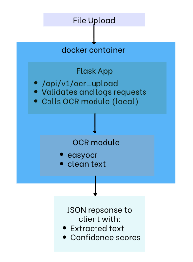

# Handwriting OCR Microservice

A containerized Flask-based OCR microservice using EasyOCR to extract handwritten text from uploaded images. This project demonstrates a simple machine-learning data pipeline, API design, and containerized deployment using Docker.

---

## 1) Executive Summary

**Problem:**  
Handwritten notes, assignments, and images often need to be digitized quickly. Manually transcribing text from images is slow and error-prone.

**Solution:**  
This project provides a lightweight handwriting OCR service built with Flask and EasyOCR, packaged inside a Docker container. Users upload an image through a simple web interface, and the API returns extracted text along with confidence scores.

---

## 2) System Overview

### **Course Concept(s) Used**
- **Flask REST API** for handling image uploads  
- **Data Pipeline:** image upload → preprocessing → OCR model → structured JSON  
- **Containerization:** reproducible environment built using Docker  

### **Architecture Diagram**

### **Data, Models, Services**
- **OCR Model:** EasyOCR English model (Apache 2.0 License)  
- **Backend Framework:** PyTorch (BSD License)  
- **Frontend:** Simple HTML upload interface (`index.html`)  
- **Input Format:** JPG/PNG images  
- **Output Format:** JSON list of extracted text + confidence scores  

---

## 3) How to Run (Local)

### **Using Docker**

#### Build and Run (one command)
bash \
sh run.sh \
or manually: \
docker build -t ocr-service:latest . \
docker run --rm -p 8080:8080 ocr-service:latest 

## 4) Design Decisions

### Why These Tools?
- Flask is lightweight and ideal for simple REST APIs.  
- EasyOCR performs well on handwriting with minimal preprocessing.  
- Docker ensures reproducibility across machines.

### Alternatives Considered
- **Tesseract OCR:** poor handwriting accuracy  
- **FastAPI:** more complex than needed  
- **Cloud deployment:** optional extra credit, not required  

### Tradeoffs
- PyTorch + EasyOCR create a larger Docker image  
- CPU inference speed varies by image size  
- Handwriting accuracy depends heavily on clarity  

### Security & Privacy
- Uploaded images are not stored  
- No secrets or environment variables required  
- Basic input validation prevents invalid file types  

### Ops / Limitations
- No GPU acceleration  
- English handwriting only  
- Basic logging via Flask console output  

---

## 5) Results & Evaluation

### Example OCR Output
json 
{ 
  "ok": true, 
  "results": [ 
    { "text": "hello", "confidence": 0.82 }, 
    { "text": "world", "confidence": 0.77 } 
  ] 
} 

### Validation Tests
This project includes a simple smoke test file:
**To run tests:**
1. Start the Docker container  
2. Add a sample image at: assets/sample1.jpg
3. Run:
bash
python test_api_and_ocr.py

## 6) What’s Next

- Improve accuracy and play around with OCR more
- Add bounding-box visualization for detected text
- Deploy service to cloud for optional extra credit
- Improve the frontend interface
- Add batch OCR endpoint for multiple images

## 7) Links
GitHub Repository:
[repo](https://github.com/paz5at/ocr-case-study)

## Credits
- EasyOCR — Apache 2.0 License
- PyTorch — BSD License
- Basic frontend upload UI inspired by a ChatGPT-assisted template

**LICENSE under the LICENSE file** 

